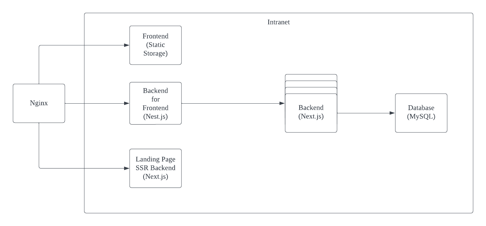
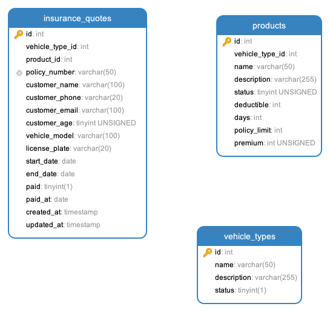

# AXA Assignment

## Summary

There are four projects to implement the AXA assignment.

1. [**backend-api**](https://github.com/mehunk/axa-assignment-api): One of backend services to access database and provide api to the backend for frontend.
2. [**backend-for-frontend**](https://github.com/mehunk/axa-assignment-bff): Another backend service to provide api to the frontend.
3. [**frontend**](https://github.com/mehunk/axa-assignment-frontend): Frontend service to provide user interface to create insurance quote.
4. [**landing page**](https://github.com/mehunk/axa-assignment-landing-page): Landing page which can be searched by user and has a link to frontend.

## Architecture

## How to run

I have deployed all of these projects to Cloudflare Page or Vercel by GitHub Actions. You can access them by the following links.

- [Landing Page](https://axa-assignment-landing-page.vercel.app/)
- [Frontend](https://axa-assignment-frontend.pages.dev/insurance-quotes/new)

### How to deploy

I use GitHub Actions to deploy all of these projects. You can find the workflow files in the `.github/workflows` folder.

Due to time constraints, I did not write the docker-compose file to deploy all of these projects. If you want to run these projects locally, you need to run manually.

## Design Considerations

### MySQL

I design the database schema as the following.

- **vehicle_types**: It stores the vehicle types.
- **products**: It stores all products related to vehicle types.
- **insurance_quotes**: It stores all insurance quotes that users created.

Relationships between tables are as the following.
- vehicle_type 1-N product
- vehicle_type 1-N insurance_quote
- product 1-N insurance_quote

I do not use the foreign key constraint because I want to keep the database simple. I think it is not necessary to use the foreign key constraint in this case. Besides, foreign key will slow down the database performance.

### Backend API

I spent a lot of time on the backend API. I used the following technologies.

- **Nest.js**: It is a Node.js framework. I used it because it is built on the express.js and easy to create a REST API server.
- **Sequelize**: It is an ORM library for Node.js. I used it because it is easy to access the database. Due to time constraints, I did not use the migration feature of Sequelize. I created the database schema manually.
- **Jest**: It is a testing framework for Node.js. I used it because it is easy to write unit tests.
- **Supertest**: It is a library to do the e2e test. I used it because it is easy to test HTTP requests.

### Backend for Frontend

I used the following technologies. Due to time constraints, I did not write unit tests.

- **Nest.js**: It is a Node.js framework. I used it because it is built on the express.js and easy to create a REST API server.
- **Axios**: It is a library to do the HTTP request. I used it to request the api of Backend API service.

### Frontend

I used the following technologies. I've written unit tests for the components, but I really don't have time to write e2e tests.

Because this project do not need SEO, I did not use Next.js. I used Vite to build the project. It is much faster than webpack.
Because there are only two pages in this project, I did not use the lazy loading feature of React. I think it is not necessary to use it in this case.

- **Vite**: It is a frontend build tool. It is much faster than webpack. And it is easy to use.
- **Vitest**: It is a testing framework for Vite. The api is almost the same as Jest. I used it because it is faster than Jest.
- **React**: I used it because it preferred by you, haha.
- **Ant Design**: I used it because it is easy to use and has a lot of components and I don't need to implement the basic components by myself in advance to finish the assignment.
- **Styled Components**: I used it because it is easy to write CSS in JS. But I think naming component is not an easy thing. Maybe I recommend TailwindCSS more.
- **eslint**
- **prettier**
- **husky**
- **lint-staged**
- **commitlint**
- **MSW**: It is a library to mock the HTTP request. I used it mock data in unit test.

### Landing Page

I used the following technologies. 

- **Next.js**: It is a React framework can provide SSR and SSG. I used it because I need SEO for the landing page.
- **TailwindCSS**: It is a CSS framework. I used it because it is easy to use and I do not need to worry about naming the class anymore.
